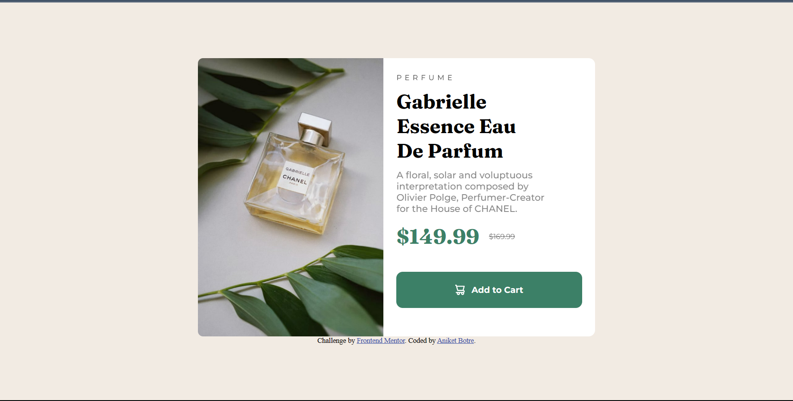

# Frontend Mentor - Product preview card component solution

This is a solution to the [Product preview card component challenge on Frontend Mentor](https://www.frontendmentor.io/challenges/product-preview-card-component-GO7UmttRfa). Frontend Mentor challenges help you improve your coding skills by building realistic projects. 

## Table of contents

- [Overview](#overview)
  - [The challenge](#the-challenge)
  - [Screenshot](#screenshot)
  - [Links](#links)
- [My process](#my-process)
  - [Built with](#built-with)
  - [What I learned](#what-i-learned)
  - [Continued development](#continued-development)
  - [Useful resources](#useful-resources)
- [Author](#author)

**Note: Delete this note and update the table of contents based on what sections you keep.**

## Overview

### The challenge

Users should be able to:

- View the optimal layout depending on their device's screen size
- See hover and focus states for interactive elements

### Screenshot

### Links

- Solution URL: [Add solution URL here](https://github.com/Aniket200-ind/product-review-component)
- Live Site URL: [Add live site URL here](https://aniket200-ind.github.io/product-review-component/)

## My process

### Built with

- Semantic HTML5 markup
- SASS custom properties
- Flexbox
- Mobile-first workflow

### What I learned
I learned more about responsive layouts and mobile-first development from this project. I also learned how to render different images for different screen sizes. Also explored some SASS properties.

### Continued development

I would continue to focus on my css skills and learn more about responsive layouts and mobile-first development. I will also like to play more with SASS.

## Author
- Frontend Mentor - [@Aniket200-ind](https://www.frontendmentor.io/profile/Aniket200-ind)